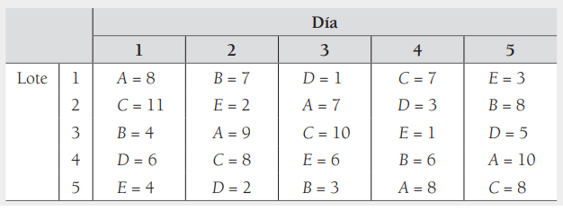

```{r, include = FALSE}
library(reticulate)
Sys.setenv(RETICULATE_PYTHON = system("which python", intern = TRUE))
```

```{python}
import pandas as pd
import numpy as np
import matplotlib.pyplot as plt
import matplotlib.colors as mcolors
import seaborn as sns
import statsmodels
import statsmodels.api as sm
from statsmodels.formula.api import ols
from statsmodels.stats.multicomp import pairwise_tukeyhsd
import statsmodels.formula.api as smf
import scipy.stats as stats
```

# Enunciado

Se quiere estudiar el efecto de cinco diferentes catalizadores (A, B, C, D y E) sobre el tiempo de reacción de un proceso químico. Cada lote de material sólo permite cinco corridas y cada corrida requiere aproximadamente 1.5 horas, por lo que sólo se pueden realizar cinco corridas diarias. El experimentador decide correr los experimentos con un diseño en cuadro latino para controlar activamente los lotes y días. Los datos obtenidos son:



# Creación y visualización del dataframe

```{python}
lote = ["Lote 1", "Lote 2", "Lote 3" , "Lote 4", "Lote 5"]
dia = ["Lunes" , "Martes" , "Miercoles" , "Jueves" , "Viernes"]
catalizador = ["A", "B", "D","C","E", "C", "E", "A","D", "B", "B", "A", "C", "E", "D", "D", "C", "E", "B", "A", "E", "D", "B", "A", "C"]
tiempo = [8, 7, 1, 7, 3, 11, 2, 7, 3, 8, 4, 9, 10, 1, 5 , 6, 8, 6, 6, 10, 4, 2, 3, 8, 8]

DCL = pd.DataFrame({
  "Lote": np.repeat(["Lote 1" , "Lote 2" , "Lote 3" , "Lote 4", "Lote 5"], 5),
  "Dia": dia * 5,
  "Catalizador": catalizador,
  "Tiempo": tiempo
})

print(DCL)
```


# Boxplot de la data

```{python}
fig, axs = plt.subplots(1, 3, figsize = (20, 6))
axs[0].set_title("Tiempo vs Catalizador")
sns.boxplot(
  x = "Catalizador",
  y = "Tiempo",
  data = DCL,
  ax = axs[0],
  color = "skyblue",
  boxprops = dict(alpha = .7),
  medianprops = dict(color = "red")
)
sns.swarmplot(
  x = "Catalizador",
  y = "Tiempo",
  data = DCL,
  color = "green",
  alpha = 0.7,
  ax = axs[0]
)

axs[1].set_title("Tiempo vs Dia")
sns.boxplot(
  x = "Dia",
  y = "Tiempo",
  data = DCL,
  ax = axs[1],
  color = "lightcoral",
  boxprops = dict(alpha = .7),
  medianprops = dict(color = "red")
)
sns.swarmplot(
  x = "Dia",
  y = "Tiempo",
  data = DCL,
  color = "red",
  alpha = 0.2,
  ax = axs[1]
)

axs[2].set_title("Tiempo vs Lote")
sns.boxplot(
  x = "Lote",
  y = "Tiempo",
  data = DCL,
  ax = axs[2],
  color = "lightgreen",
  boxprops = dict(alpha = .7),
  medianprops = dict(color = "red")
)
sns.swarmplot(
  x = "Lote",
  y = "Tiempo",
  data = DCL,
  color = "blue",
  alpha = 0.9,
  ax = axs[2]
)
```


# Análisis de varianza

```{python}
modelo = ols(
  "Tiempo ~ Catalizador + Lote + Dia",
  data = DCL
).fit()
anova_table = sm.stats.anova_lm(modelo, typ=1)
print(anova_table)
print(modelo.summary())
```

# Prueba HSD de Tukey

```{python}
# Parámetros
alpha = 0.05
k = 5  # Número de grupos
df_error =  modelo.df_resid  # Grados de libertad del error (N-k)

# Calcular el valor crítico del rango studentizado
q_critical = stats.studentized_range.ppf(1 - alpha, k, df_error)
HSD = q_critical * np.sqrt(modelo.mse_resid / k)

print(f'Terminos del HSD')
print(f'MSE = {modelo.mse_resid:.2f}')
print(f"El rango studentizado para alpha = {alpha}, k = {k}, df_error = {df_error} es: q_critical = {q_critical:.2f}")
print(f'HSD teorico de la hipotesis principal es HSD = {HSD}')

def generate_hsd(variable: str, alpha: float):
  tukey = pairwise_tukeyhsd(
    endog=DCL["Tiempo"],
    groups=DCL[variable],
    alpha=alpha
  )

  tukey.plot_simultaneous()
  print(tukey.summary())

aplha = 0.001

generate_hsd("Catalizador", alpha)
```

```{python}
generate_hsd("Lote", alpha)
```

```{python}
generate_hsd("Dia", alpha)
```

# Prueba LSD

```{python}
# Parámetros
alpha = 0.05
k = 5  # Número de grupos (Catalizador)
N = len(DCL)  # Número total de observaciones
df_error = modelo.df_resid  # Grados de libertad del error (N-k)

# Obtener el valor crítico t para la prueba LSD
t_critical = stats.t.ppf(1 - alpha / 2, df_error)

# Obtener el MSE del modelo
mse = modelo.mse_resid

# Calcular el tamaño de muestra promedio por grupo
n = DCL.groupby('Catalizador')['Tiempo'].count().mean()

# Calcular la LSD
LSD = t_critical * np.sqrt(2 * mse / n)

print(f'Términos de la LSD')
print(f'el valor de n = {n}')
print(f'MSE = {mse:.2f}')
print(f"El valor crítico t para alpha = {alpha/2}, df_error = {df_error} es: t_critical = {t_critical:.2f}")
print(f'LSD teórico para la hipótesis principal es LSD = {LSD:.2f}')

def generate_lsd(variable: str):
  tukey = pairwise_tukeyhsd(
    endog=DCL["Tiempo"],
    groups=DCL[variable],
    alpha=alpha
  )

  tukey.plot_simultaneous()
  print(tukey.summary())

generate_hsd("Catalizador", alpha)
```
